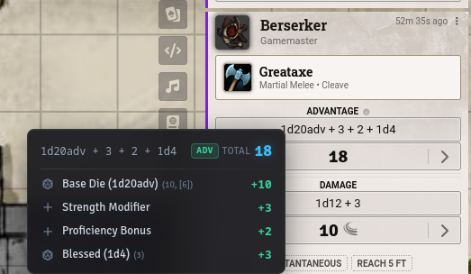

# yugen-modifiers

Breakdown of dice rolls and modifiers as well as token information (health, conditions, gear, race, name, etc.). Token information can be customized or turned off.

## Compatibility
- Fully compatible with core Foundry VTT (V13 & V14).
- Fully compatible with the Midi-QOL module.
- DnD 5e.
