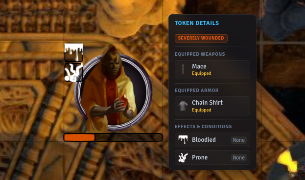
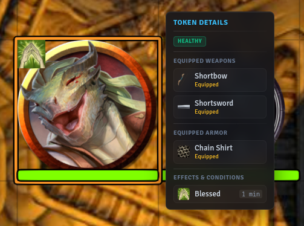

# yugen-modifiers

Breakdown of dice rolls and modifiers as well as token information (health, conditions, gear, race, name, etc.). Token information can be customized or turned off. [Click here for a video example](https://youtube.com/shorts/4-EvI7thfxI?feature=share).

 

## Dynamic Token Changer

When a actor is modified by equipping/unequipping an item, you can change their token dynamically. This is a great addition for artists who have multiple images of their character wearing or using different things.

## Compatibility

- Fully compatible with core Foundry VTT (V13 & V14).
- Fully compatible with the Midi-QOL module.
- DnD 5e.
